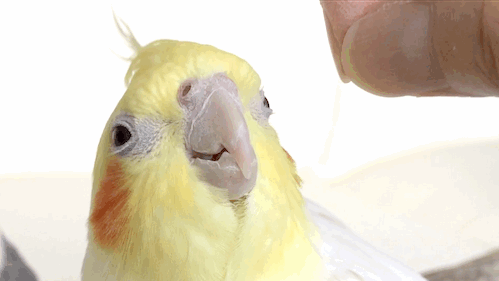

<pre align="center">
                                            ░▒█▀▀▄░▀█▀░▒█▀▀▀█░▒█▄░▒█░▒█▀▀▀░▒█░░░░█▀▀▄
                                            ░▒█▄▄▀░▒█░░▒█░░▒█░▒█▒█▒█░▒█▀▀▀░▒█░░░▒█▄▄█
                                            ░▒█░▒█░▄█▄░▒█▄▄▄█░▒█░░▀█░▒█▄▄▄░▒█▄▄█▒█░▒█
</pre>

  

A developer from 🇬🇪

_____________________________________

  
  
  
  
  

